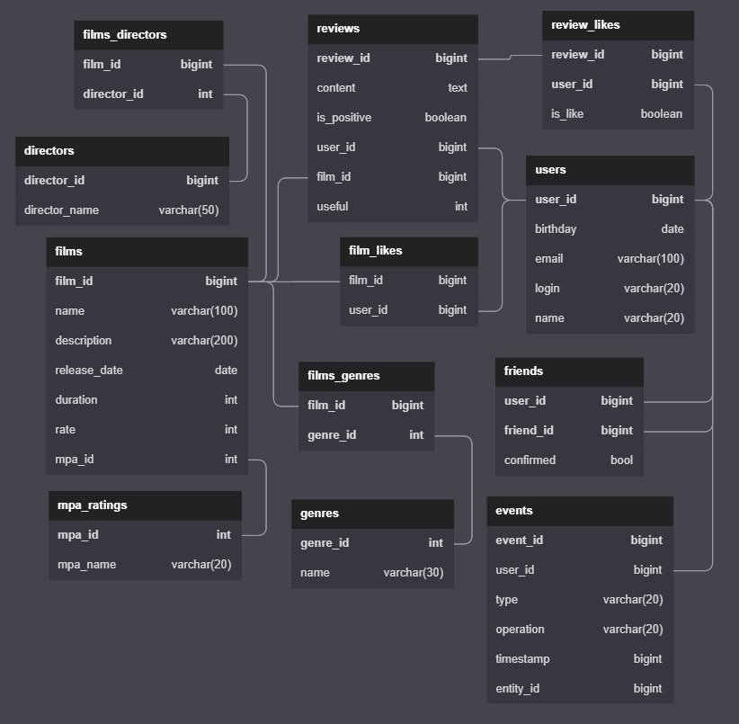

# Rest API for film rating service
This is a group project made by a team of five students. My role was the teamlead.

This is the first project in which we used maven and spring boot. The project is a rest API for a movie rating service. 
Users can rate movies and get recommendations. You can add users as friends and view their event feed.

The service allows:
- rate movies
- friending/unfriending users
- get recommendations based on friends ratings
- view your friends event feed

Data is stored in embedded H2 database. The database diagram is given below.

